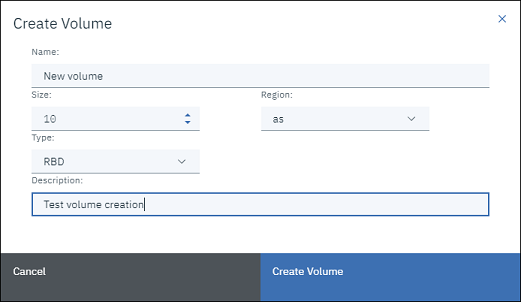
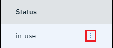
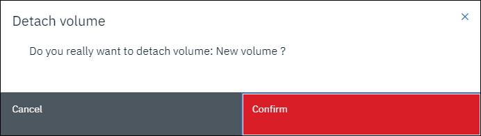

# Volumes
---

{: .no_toc }

In this page, you can find an explanation of how to create, edit, attach and detach volumes in Ventus Cloud Portal.

## Table of contents

{: .no_toc .text-delta }

1. TOC
   {:toc}

## About Volumes page
---

You can get to the volume page through the left-bar menu:

- In upper left corner click on menu icon

- And click on Volumes in opened menu

**Page content:**

Volume page consist of **headers** which include all needed information about volume, **Create button**, **side bar menu** on the right side of page, **search bar** in front of create button:

Headers include:

- **Name:** The name of volume.
- **Region:** Shows in which region volume will be located.
- **Size:** Shows volume size.
- **Type:** Shows volume type.
- **Description:** Shows description to volume.
- **Status:** Shows in which status volume is. If volume is free, status will be `available` other way status will be `in-use`.

## Create volume
---

To create a volume, you need click on the create button in the left upper corner of volume page.

The create button will open **Create volume** window, which consist of required and optional fields for volume creation, and two buttons **Create Volume** and **Cancel**:

The required fields is: `Name`, `Size`, `Region`, `Type`.
Optional field is: `Description`.

First of all you must specify volume name, size and region. Only after region was selected you can choose volume type. And after you can fill description as needed.

- **Name** of volume can include all letter, numbers or symbols and must be not bigger then 255 characters. If volume was created by instance, name will be automaticly fill with volume ID.
- **Size** can be specifed in the range from 10 GB to 1000 GB. Minimal availabel size `10 GB` is selected by default when you opening create window.
- **Region** can be specifed from three available regions: `as`, `us`, `vs`. It depends on which region the created volume will be located.
- **Type** can be specifed from two available types: `RBD` and `__DEFAULT__`.
- **Description** can include all letter, numbers or symbols and must be not bigger then 255 characters.

When you specify all required fields click on **Create Volume** button.

Then, the volume creation window will close and after a few seconds the volume you created will appear with the status `available`

**Cancel** button will close volume creation window and will update all fields to their default state.

## Attach/Detach volume
---

### Attach volume

To attach volume you must choose volume which has `available` status and click on side bar menu.

In opened dropdown menu click on `Attach Volume` option.



The attach button will open **Attach Volume** window, which contains a field for selecting the instance to which the volume will be attached, and two buttons **Attach Volume** and **Cancel**:

After choosing an instance, click on **Attach Volume** button. 

Then, the attach volume window will close and after a few seconds the volume will attached to instance and will go into status `in-use`

**Cancel** button will close attach volume window.

### Detach volume

To detach volume you must choose volume which has `in-use` status and click on side bar menu.

In opened dropdown menu click on `Detach Volume` option.



It will open confirmation window where user must confirm volume detach or cancel it.

**Cancel** button will close volume detach window.

**Confirm** button will close detach volume window and after a few seconds the volume will detach from instance and will go into status `available`.



## Edit volume
---

## Delete volume
---

To delete volume you can use two deferent ways:

- Through the **side bar menu** of volume
- Through the **checkbox** in front of volume Name.

To delete volume through the side bar menu you must click on it in right side of volume you want to delete.

In opened dropdown menu click on `Delete` option.

It will open confirmation window where user must confirm volume deletion or cancel it.

**Cancel** button will close volume deletion window.

**Confirm** button will close volume deletion window and after a few seconds the volume will be deleted.
