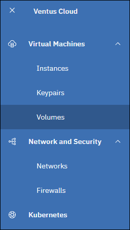
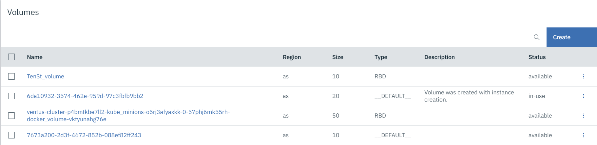
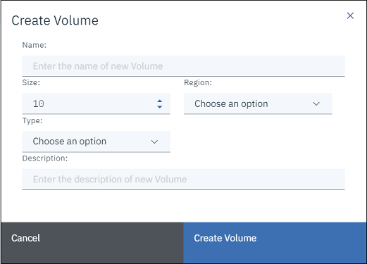
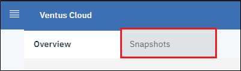

# Volumes
{: .no_toc }
---
In this page, you can find an explanation of how to create, edit, attach and detach volumes in Ventus Cloud Portal.

## Table of contents
{: .no_toc .text-delta }

1. TOC
{:toc}

## About Volumes page
---

You can get to the volume page through the left-bar menu:

- In upper left corner click on menu icon

- And click on Volumes in opened menu

**Page content:**

Volume page consist of **headers** which include all needed information about volume, **Create button**, **side-bar menu** on the right side of page, **search bar** in front of create button:

Headers include:

- **Name:** The name of volume.
- **Region:** Shows in which region volume will be located.
- **Size:** Shows volume size.
- **Type:** Shows volume type.
- **Description:** Shows description to volume.
- **Status:** Shows in which status volume is. If volume is free, status will be `available` other way status will be `in-use`.

## Create volume
---

To create a volume, you need click on the create button in the right upper corner of volume page.

It will open **Create volume** window, which consist of required and optional fields for volume creation, and two buttons **Create Volume** and **Cancel**:

The required fields is: `Name`, `Size`, `Region`, `Type`.
Optional field is: `Description`.

First, you must specify volume name, size and region. Only after region was selected you can select volume type. And after you can fill description as needed.

- **Name** of volume can include all letter, numbers or symbols and must be not bigger than 255 characters. If volume was created by instance, name will be automatically filled with volume ID.
- **Size** can be specified  in the range from 10 GB to 1000 GB. Minimal available size `10 GB` is selected by default when you are opening create window.
- **Region** can be specified  from three available regions: `as`, `us`, `vs`. It depends on which region the created volume will be located.
- **Type** can be specified  from two available types: `RBD` and `__DEFAULT__`.
- **Description** can include all letter, numbers or symbols and must be not bigger than 255 characters.

When you specify all required fields click on **Create Volume** button.

Then, the "Create Volume" window will close and after a few seconds the volume you created will appear with the status `available`

**Cancel** button will close volume "Create Volume" window and will update all fields to their default state.

## Attach/Detach volume
---

 

- ### Attach volume

To attach volume you must select volume which has `available` status and click on side-bar menu.

In opened dropdown menu click on `Attach Volume` option.



It will open **Attach Volume** window, which contains a field for selecting the instance to which the volume will be attached, and two buttons **Attach Volume** and **Cancel**:

After you have selected an instance, click on **Attach Volume** button. 

Then, the "Attach Volume" window will close and after a few seconds the volume will be attached to instance and will go into status `in-use`

**Cancel** button will close "Attach Volume" window.

 

- ### Detach volume

To detach volume you must select volume which has `in-use` status and click on side-bar menu.

In opened dropdown menu click on `Detach Volume` option.



It will open confirmation window where user must confirm volume detach or cancel it.

**Cancel** button will close "Detach Volume" window.

**Confirm** button will close "Detach Volume" window and after a few seconds the volume will detach from instance and will go into status `available`.



## Edit volume
---
To edit volume you must click on it in side-bar menu of volume you want to edit.

In opened dropdown menu click on `Edit` option.

It will open **Edit volume** window, which consist of fields and options for volume you want to edit, and two buttons **Create Volume** and **Cancel**:

Options you can update:

- **Name** of volume can include all letter, numbers or symbols and must be not bigger than 255 characters.
- **Description** can include all letter, numbers or symbols and must be not bigger than 255 characters.
- **Bootable status** can be changed by clicking on **Bootable** checkbox in edit volume window. 



After you have updated volume options, click on **Edit Volume** button. 

Then, the "Edit Volume" window will close and volume will be updated.

**Cancel** button will close "Edit Volume" window.

## Delete volume
---

There are two deferent ways to delete volume:

- Through the **side-bar menu** of volume
- Through the **checkbox** in front of volume Name.

- To delete volume through the side-bar menu you must click on it in right side of volume you want to delete.

In opened dropdown menu click on `Delete` option.

It will open confirmation window where user must confirm volume deletion or cancel it.

**Cancel** button will close "Delete Volume" window.

**Confirm** button will close "Delete Volume" window and after a few seconds the volume will be deleted.

 - To delete volume through checkbox you must click on it in front of volume Name of volume you want to delete.

When you select a volume, instead of the **Create** button, a **Delete** and **Cancel** buttons will appear in the upper right corner of the volume page.

**Cancel** button will cancel selection and return volume in default state.

**Delete** button will delete volume without confirmation.

Also, you can multi-delete volumes. For that select as more volumes as you need by clicking on their checkboxes. The counter in header will show you how many volumes you had selected.

Click **Delete** button as in previous action to delete selected volumes. Deletion will be done without confirmations.

## Details volume page
---

To get to the Volume details page you must click on volume name 

Then you will go to the **Volume details page** where contains more details information about volume like: `volume ID`, `bootable status`, `created/updated` time.

Also, there is a transition to the **Snapshots page** through link in header.

